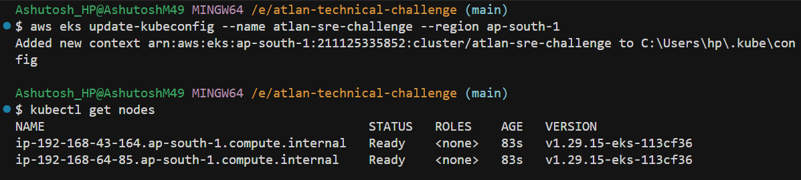

# Atlan SRE-II Take Home Challenge

## Author
**Name:** Ashutosh Mohanty  
**Role Applied:** Site Reliability Engineer (SRE-II)  
**Date:** November 2, 2025  

---

## Overview

This repository contains my solution for Atlan's **SRE-II Take-Home Challenge**.  
It demonstrates my approach to:
- Diagnosing and fixing complex outages in a Kubernetes-based system.
- Correlating metrics and logs using Prometheus + Grafana.
- Applying SRE best practices for reliability and prevention.

---

## Tech Stack

| Component | Purpose |
|------------|----------|
| **EKS (AWS)** | Kubernetes cluster hosting the environment |
| **Prometheus + Grafana** | Monitoring & metrics visualization |
| **Frontend App** | Simple HTTP client (curl loop) |
| **Backend App** | Dummy API (httpbin) |
| **NetworkPolicy** | Used to simulate DNS blocking |
| **kubectl / helm / eksctl** | Cluster management tools |

---

## Objective
Provision a lightweight, personal EKS cluster to host the simulated outage environment for Atlan's SRE challenge.

---

## Commands

```bash
eksctl create cluster \
  --name atlan-technical-challenge \
  --region ap-south-1 \
  --nodegroup-name atlan-nodes \
  --node-type t3.medium \
  --nodes 2 \
  --managed
```
We can either run this or the script in `scripts/`
After creation:
```bash
aws eks update-kubeconfig --name atlan-technical-challenge --region ap-south-1
kubectl get nodes
```

after running the commands we can see something like this


### EKS Cluster Setup and CNI Configuration

The Amazon EKS cluster (`atlan-technical-challenge`) was set up and configured to use Calico as the primary CNI. This setup enables enhanced observability, reliability, and fine-grained network control within the Kubernetes environment.
### Cluster Setup Summary
- Created EKS cluster without nodegroups
- Removed AWS VPC CNI
- Installed Calico using Helm (v3.31.0)
- Added worker nodes
- Verified node and CNI readiness

1. **Create the EKS cluster without nodes**
   ```bash
   eksctl create cluster --name atlan-technical-challenge --without-nodegroup
   ```
2. **Remove the default AWS CNI**
```bash
kubectl delete daemonset -n kube-system aws-node
```
3. **Add Calico Helm repository**
```bash
helm repo add projectcalico https://docs.tigera.io/calico/charts
helm repo update
```
4. **Create namespace for operator**
```bash
kubectl create namespace tigera-operator
```
5. **Install Calico Operator**
```bash
helm install calico projectcalico/tigera-operator \
  --version v3.31.0 \
  --namespace tigera-operator
```
6. **Patch the default installation to use Calico as the CNI**
```bash
kubectl patch installation default \
  --type='json' \
  -p='[{"op": "replace", "path": "/spec/cni", "value": {"type":"Calico"} }]'
```
7. **Add nodegroup**
```bash
eksctl create nodegroup \
  --cluster atlan-technical-challenge \
  --node-type t3.medium \
  --max-pods-per-node 100
```
8. **Verify**
```bash
kubectl get pods -n tigera-operator
kubectl get pods -n calico-system
kubectl get daemonset -n calico-system
```
