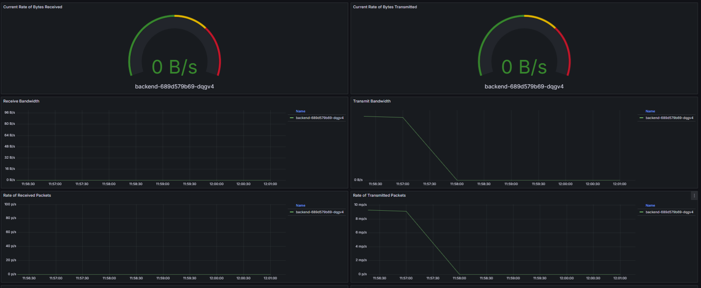
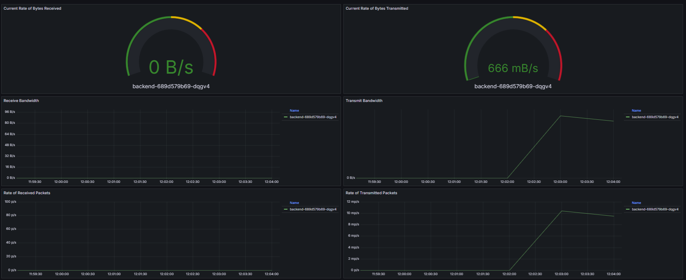
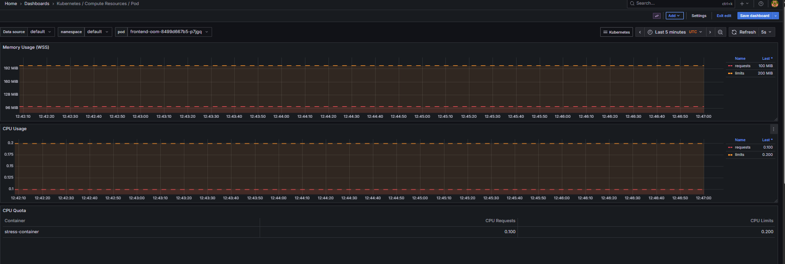
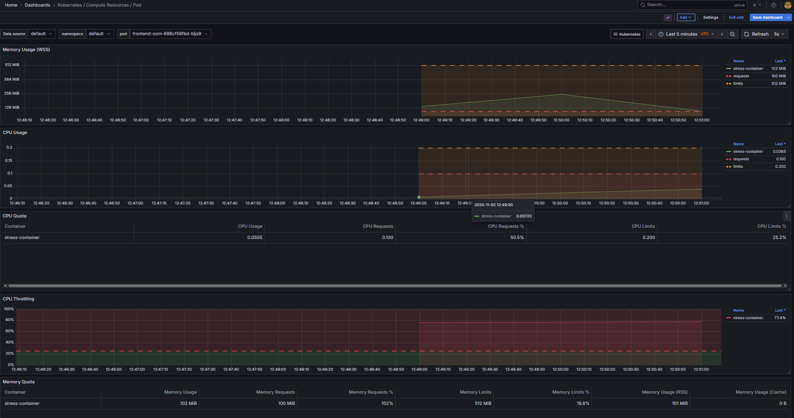
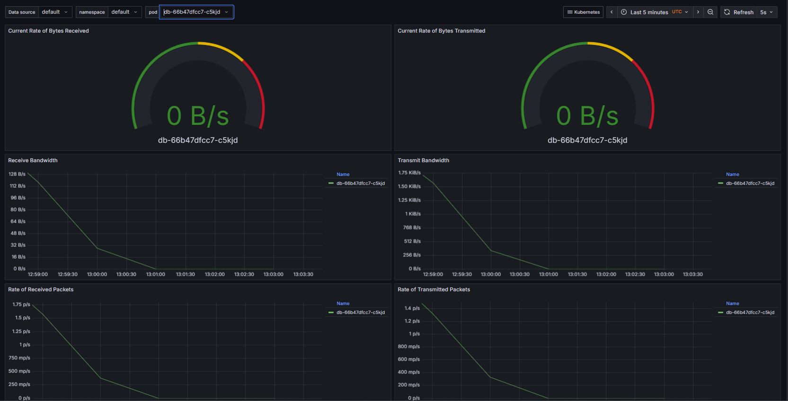
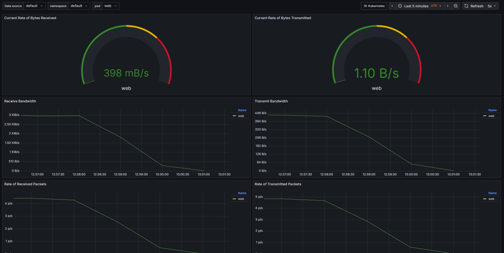
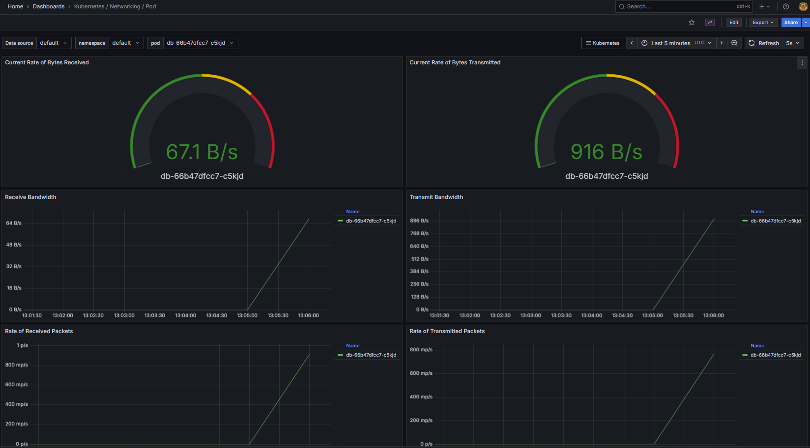

## Issue 1 — Service Connectivity
**Problem:** Frontend → backend unreachable.  
**Root Cause:** Service selector mismatch.  
**Fix:** Updated selector; verified endpoints & connectivity.  
**Evidence:**  
  

## Issue 2 — OOMKilled Pod
**Problem:** Frontend pod terminated with exit 137.  
**Root Cause:** Memory limit too low.  
**Fix:** Increased limit; verified stable metrics.  
**Evidence:**  
  

## Issue 3 — Network Policy Enforcement
**Problem:** Network isolation validation.  
**Fix:** Applied default-deny and allow-web-to-db policies.  
**Evidence:**  
  
  

## Monitoring
Installed kube-prometheus-stack with Grafana dashboards:
- Pod resource utilization
- Service connectivity
- Network IO  

## Lessons Learned
- Always validate selectors with `kubectl get endpoints`
- Use Grafana to baseline normal pod memory usage
- Default-deny NetworkPolicies should be applied cluster-wide
