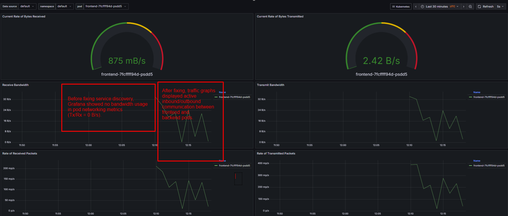

## Issue 1 — Service Discovery Failure

### Description
Frontend pods were unable to connect to backend. The backend Service had no endpoints due to a selector mismatch.

---

### Debug Steps

#### step-1: Check service selector
```bash
kubectl get svc backend-svc -o yaml | grep selector
```
output:
```yaml
  selector:
    app: backend-api    # (was set incorrectly: did not match pods' label)
```

#### step-2: Check running backend pods and their labels
```bash
kubectl get pods -l app=backend -o wide
```
```text
NAME                       READY   STATUS    RESTARTS   AGE   IP              NODE                                           NOMINATED NODE   READINESS GATES
backend-689d579b69-68rqk   1/1     Running   0          46m   192.168.70.15   ip-192-168-64-85.ap-south-1.compute.internal   <none>           <none>
```

```bash
kubectl describe pod -l app=backend | grep -i "Labels"
```
```text
Labels:           app=backend
```

#### step-3: Check service endpoints — **before fix** and **after fix**

**Before fix**
```bash
kubectl get endpoints backend-svc
```
```text
NAME          ENDPOINTS   AGE
backend-svc   <none>      49m
```

**After fix**
```bash
kubectl get endpoints backend-svc
```
```text
NAME          ENDPOINTS          AGE
backend-svc   172.16.35.201:80   75m
```
> **Notice:** Before the fix, the service had no endpoints (`<none>`), so traffic from frontend could not reach the backend pod. After correcting the selector, the backend pod IP appears as an endpoint.

#### step-4: Logs from frontend (connectivity check)

**Before fix**
```bash
kubectl exec -it deploy/frontend -- curl backend-svc
```
```text
curl: (7) Failed to connect to backend-svc port 80 after 2 ms: Could not connect to server
command terminated with exit code 7
```

**After fix**
```bash
kubectl exec -it deploy/frontend -- curl backend-svc
```
```html
<!DOCTYPE html>
<html lang="en">
<head>
    <meta charset="UTF-8">
    <title>httpbin.org</title>
    <!-- (rest of valid HTML httpbin.org page omitted for brevity) -->
</head>
<body>
<!-- Normal httpbin.org homepage HTML -->
</body>
</html>
```

---

### Root Cause Analysis

The Service was configured with a selector `app=backend-api`, but the backend pods are labeled `app=backend`. Thus, the service could not associate any backend pods as endpoints, leading to service discovery failure: the frontend received connection errors.

---

## Fix

To resolve, make sure the backend Service’s selector matches your pod labels. You can do this by either:

1. **Edit the manifest and reapply:**
   ```bash
   kubectl apply -f manifests/backend.yaml
   ```
2. **Patch the service selector directly:**
   ```bash
   kubectl patch svc backend-svc -p '{"spec":{"selector":{"app":"backend"}}}'
   ```

---

## Verification

* Confirm endpoints present after fix:
    ```bash
    kubectl get endpoints backend-svc
    ```
    Should now display backend pod IP and port in ENDPOINTS column.

* Confirm connectivity from frontend:
    ```bash
    kubectl exec -it deploy/frontend -- curl backend-svc
    ```
    Should return a valid HTTP response (HTML content, e.g. httpbin.org homepage).

---

## Required Artifacts

* `/manifests/frontend.yaml`
* `/manifests/backend.yaml`
* Logs or screenshots showing **before & after** connectivity:
    * `kubectl get endpoints backend-svc`: shows `<none>` before fix, endpoint IP(s) after fix
    * Frontend curl logs: `curl: (7) Failed to connect...` before fix, full HTML response after fix

Screenshot:
