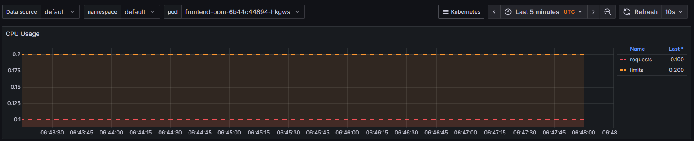
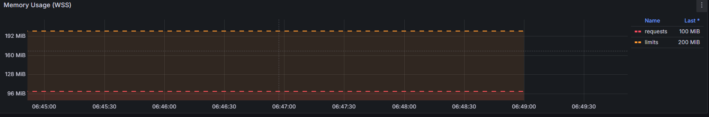

## Issue 2 — Resource Pressure / OOMKilled Pod

This issue occurred when the frontend deployment was given intentionally low memory limits, combined with a stress workload designed to trigger OOM (Out of Memory) conditions.

---

### Step 1: Reproduce

**Manifest (from `frontend-oom.yaml`):**

```yaml
apiVersion: apps/v1
kind: Deployment
metadata:
  name: frontend-oom
  labels:
    app: frontend-oom
spec:
  replicas: 1
  selector:
    matchLabels:
      app: frontend-oom
  template:
    metadata:
      labels:
        app: frontend-oom
    spec:
      containers:
        - name: stress-container
          image: polinux/stress
          args:
            - "--vm"
            - "1"
            - "--vm-bytes"
            - "250M"
            - "--vm-hang"
            - "1"
          resources:
            requests:
              memory: "100Mi"
              cpu: "100m"
            limits:
              memory: "200Mi"
              cpu: "200m"
---
apiVersion: v1
kind: Service
metadata:
  name: frontend-oom-svc
spec:
  selector:
    app: frontend-oom
  ports:
    - port: 80
      targetPort: 80
```

---

### Step 2: Observe the Failure

- Deployment creates a pod with memory limit of **200Mi**.
- Stress process tries to allocate **250M**, exceeding the limit.

Check pod status:

```txt
$ kubectl get po -l app=frontend-oom
NAME                            READY   STATUS             RESTARTS      AGE
frontend-oom-8499d667b5-p7jgq   0/1     CrashLoopBackOff   4 (22s ago)   2m8s
```

To see more detail and confirm the OOMKill:

```txt
$ kubectl describe pod -l app=frontend-oom | grep -A5 "State"
    State:          Terminated
      Reason:       OOMKilled
      Exit Code:    1
      Started:      Sun, 02 Nov 2025 18:11:29 +0530
      Finished:     Sun, 02 Nov 2025 18:11:31 +0530
    Ready:          False
```

---

### Step 3: Identify Root Cause

- The stress command in the container (`polinux/stress --vm 1 --vm-bytes 250M --vm-hang 1`) uses **250Mi**.
- The pod limit was set to **200Mi**.
- Since 250Mi > 200Mi, the kernel OOM killer terminates the process.

---

### Step 4: Resolve the Issue

- Increase the container's memory limits so the workload fits.
- Edit the manifest (`frontend-oom.yaml`):

```yaml
resources:
  requests:
    memory: "300Mi"
    cpu: "100m"
  limits:
    memory: "400Mi"
    cpu: "200m"
```

- Apply the fix:

```bash
kubectl apply -f manifests/issue-2/frontend-oom.yaml
```

Or patch the memory limit directly for immediate effect:

```bash
kubectl patch deploy frontend-oom \
  --type='json' \
  -p='[
    {"op":"replace","path":"/spec/template/spec/containers/0/resources/limits/memory","value":"512Mi"}
  ]'
```

---

### Step 5: Verify Resolution

- Wait a few moments, then check:

```bash
kubectl get pods -l app=frontend-oom
kubectl describe pod -l app=frontend-oom | grep -A5 -i "State"
```

- Pod should enter `Running` state with no restarts:

```
    State:          Running
      Started:      Sun, 02 Nov 2025 12:04:09 +0530
    Ready:          True
    Restart Count:  0
```

- Confirm in Grafana/resource dashboards:
    - Memory usage remains below the new limit.
    - No restart spikes.





---

### Extra: Example Pod State Output

```bash
kubectl describe pod -l app=frontend-oom | grep -A6 -i "State"
```
Sample problematic output:
```
    State:          Waiting
      Reason:       CrashLoopBackOff
    Last State:     Terminated
      Reason:       StartError
      Message:      failed to create containerd task: failed to create shim task: OCI runtime create failed: runc create failed: unable to start container process: error during container init: exec: "--vm": executable file not found in $PATH: unknown
      Exit Code:    128
```

Sample healthy output after fix:
```
    State:          Running
      Started:      Sun, 02 Nov 2025 12:36:47 +0530
    Ready:          True
    Restart Count:  0
    Limits:
      cpu:     200m
      memory: 512Mi
```

---

